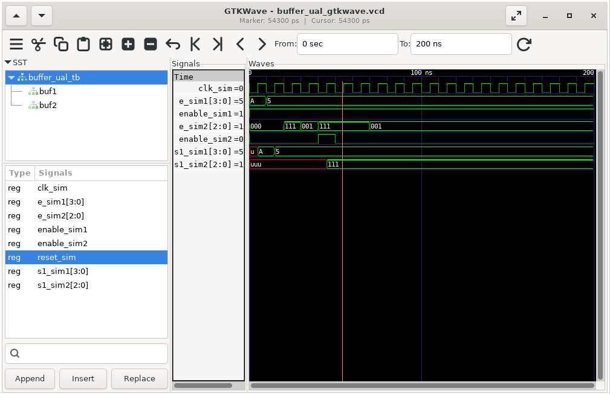
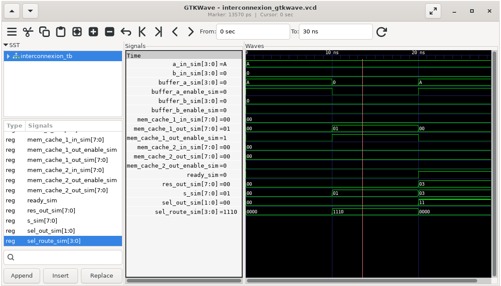
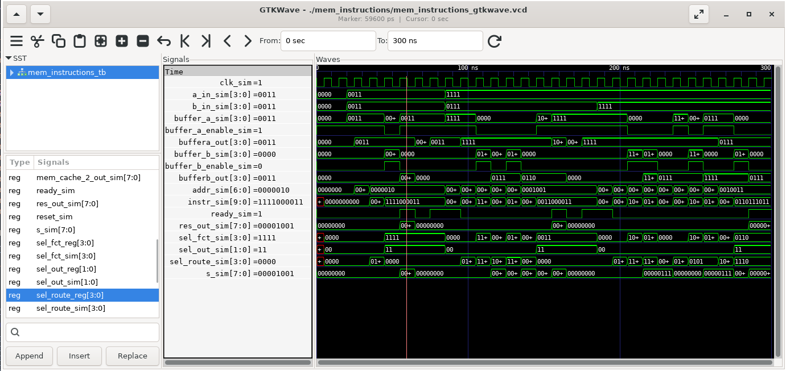
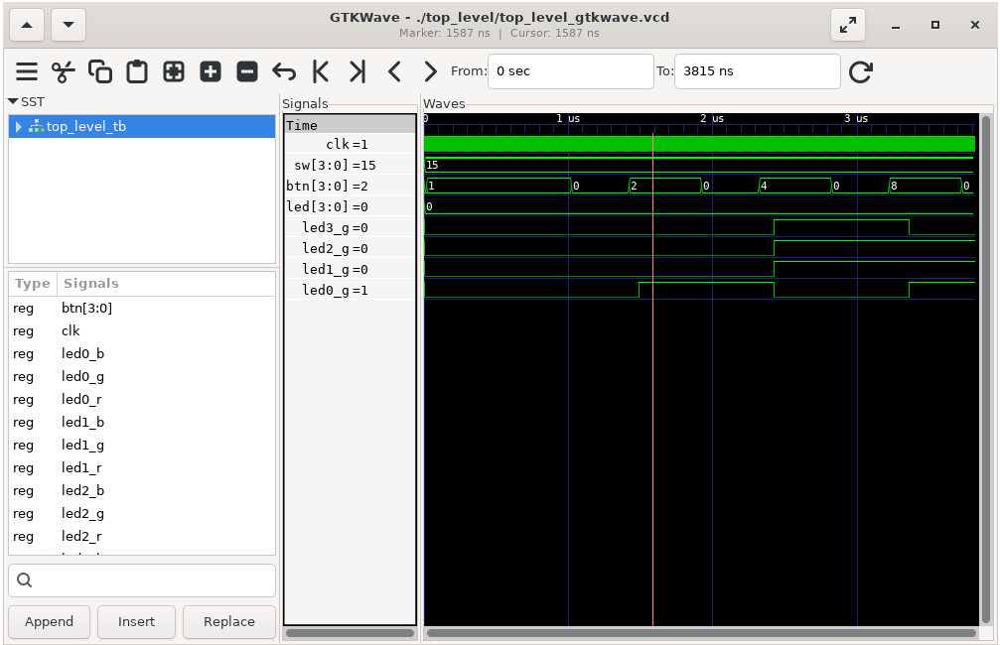
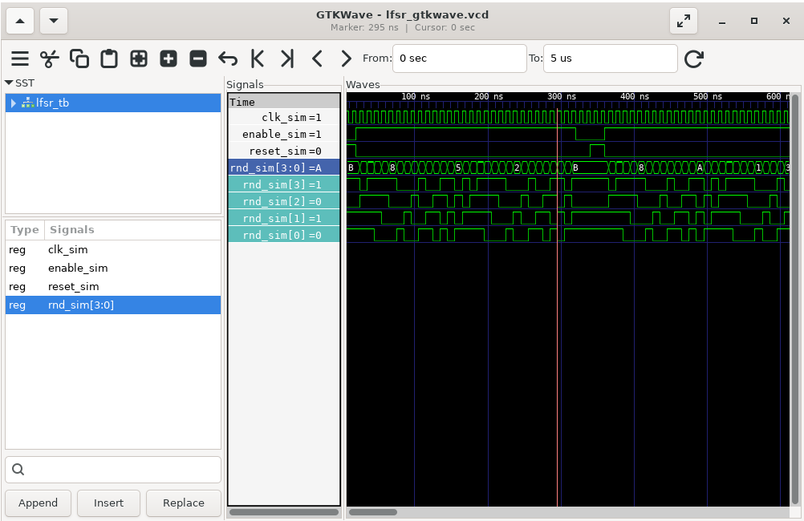

# 🎮 LogiGame – Rapport VHDL

**Auteurs :**

[Corentin KERVAGORET](https://github.com/Corentin-k) • [Arnaud GRIVEL](https://github.com/Arn7516) • [Mathias BENOIT](https://github.com/mat15tc)

Projet réalisé dans le cadre du cours de VHDL 2 à l'**EFREI Paris** en 2025.

Remarque : l'ensemble de notre projet est disponible sur Github : [VHDL-LogiGame](https://github.com/Corentin-k/VHDL-LogiGame)

---

## 🗂️ Sommaire

- [📝 Introduction](#📝-introduction)

Partie 1

### 🧩 Cœur de contrôleur

1. - [x] [1️⃣ Réalisation d'un ALU](#1️⃣-réalisation-dun-alu)
2. - [x] [2️⃣ Buffers](#2️⃣-buffers)
3. - [x] [3️⃣ Réalisation de l’interconnexion](#3️⃣-réalisation-de-linterconnexion)
4. - [x] [4️⃣ Mémoire d'instructions](#4️⃣-mémoire-dinstructions)
5. - [x] [5️⃣ Top Level](#5️⃣-top-level)

Partie 2

### 🎮 Le jeu

5. - [ ] [6️⃣ Minuteur](#6️⃣-minuteur)
6. - [ ] [7️⃣ Compteur de score](#7️⃣-compteur-de-score)
7. - [ ] [8️⃣ Vérificateur de réponse](#8️⃣-vérificateur-de-réponse)
8. - [ ] [9️⃣ Générateur pseudo-aléatoire (LFSR)](#9️⃣-générateur-pseudo-aléatoire-lfsr)
9. - [ ] [🔟 Contrôleur principal (FSM)](#🔟-contrôleur-principal-fsm)

- [📝Conclusion](#conclusion)

### 📎 Annexes

10. [Vivado : Installation et Test de l’ALU](#vivado--installation-et-test-de-lalu)

> Tous les composants `[x]` ont été testés avec des testbenchs VHDL, simulés avec GHDL et à nouveau testés sur la carte ARTY A7 avec Vivado. Les autres composants `[ ]` ont été créés mais pas encore testés.

---

<div class="page"/>

## 📝 Introduction

Ce projet consiste à réaliser un mini-jeu de type **Simon Game** sur la carte **ARTY A7** en utilisant les huit LEDs du microcontrôleur, les quatres switchs et les quatres boutons de la carte.
L’ensemble du projet a été développé sous **VS Code** avec **WSL** et simulé avec **GHDL** et **GTKWave**.

<p align="center">
  
</p>

Le projet est divisé en deux parties :

- La premiere partie du projet consiste à réaliser le cœur du microcontrôleur : l'ALU et les composants associés, afin de réaliser trois fonctions qui seront controlées par trois boutons grâce à la réalisation d'un automate à états finis (FSM) dans le top level.
  Nous avons donc réalisé les composants suivants : ALU, Buffers, Interconnexion, Mémoire d'instructions et un top Level qui réuni tous les composants.

- La seconde partie du projet consiste à réaliser les composants spécifiques au jeu : un minuteur, un compteur de score, un vérificateur de réponse, un générateur pseudo-aléatoire (LFSR) et un contrôleur principal (FSM).
  Tous ces composants ont été réalisés mais pas encore testés.

Pour chaque entité VHDL créée, nous avons développé un **testbench** complet pour valider son bon fonctionnement. Ce testbench permet de simuler l'entité et de vérifier les sorties en fonction des entrées fournies. Nous avons utilisé **GHDL** pour la simulation et **GTKWave** pour visualiser les signaux.
Nous avons également utilisé **Vivado** pour la synthèse et la programmation de la carte ARTY A7. Vivado nous a permis de vérifier le bon fonctionnement de l'ALU et de l'ensemble du microcontrôleur sur la carte.

Le projet est structuré de la manière suivante :
Vous trouverez un dossier pour chaque entité VHDL nommé `nom_entité` contenant l'entité `nom_entité.vhd` (soit l'entité `nom_entité` et son architecture `nom_entité_arch`) ; son testbench `nom_entité_testbench.vhd`, un fichier de simulation `nom_entité_gtkwave.vcd` et le resultat de la simulation `nom_entité_waves.png`.
Dans la partie [Démarrage rapide](#🚀-démarrage-rapide), nous avons créé des scripts bash pour faciliter la simulation et la compilation des différents modules. Ces scripts permettent de lancer la simulation d'un module en particulier et d'ouvrir automatiquement GTKWave pour visualiser les signaux.

---

<div class="page"/>

## 🚀 Démarrage rapide

### Prérequis

- **Windows 10/11 avec WSL** (Windows Subsystem for Linux)
- **VS Code** avec l’extension - WSL
- **GHDL** installé sous WSL (`sudo apt install ghdl gtkwave`)
- **GTKWave** pour visualiser les signaux (`sudo apt install gtkwave`)
- **Vivado** (pour la synthèse sur carte, voir : [Installation de Vivado](#vivado--installation-et-test-de-lalu))

### Installation et simulation sous WSL/VS Code

1. **Clone le dépôt** :

   ```bash
   git clone https://github.com/Corentin-k/VHDL-LogiGame.git
   cd VHDL-LogiGame
   ```

2. **Simuler un module avec le script fourni** :

   Plusieurs scripts bash sont fournis pour faciliter la simulation et la compilation des différents modules :

   - Dans le dossier racine du projet.
   - Pour tester un component qui ne dépend pas d'autres modules :

     ```bash
     ./run_vhdl.sh nom_module
     ```

     Par exemple pour tester le testbench de l'interconnexion :

     ```bash
     ./run_vhdl.sh interconnexion
     ```

   - Pour ouvrir automatiquement GTKWave (visualisation des signaux) :

     ```bash
     ./run_vhdl.sh interconnexion --g
     ```

- Pour le test de la mémoire d'instruction et le top level, deux scripts ont été réalisés.

  Les scripts compilent tous les modules nécessaires et lancent la simulation avec génération d’un fichier VCD pour GTKWave.

  ```bash
      ./test_mem.sh
      ./test_top.sh
  ```

---

<div class="page"/>

## 1️⃣ Réalisation d'un ALU

L'ALU (Arithmetic and Logic Unit) est l'unité de calcul du microcontroleur. Elle est capable de réaliser des opérations arithmétiques et logiques sur des entiers de 8 bits.
Elle est composée de plusieurs unités fonctionnelles, où chaque unité est responsable d'une opération spécifique. L'ALU est contrôlée par un signal de sélection `SEL_FCT` qui détermine quelle opération doit être effectuée sur les entrées `A` et `B` .

### ✨ Entité `Hearth_UAL`

L’ALU prend en entrée :

- Deux valeurs A et B sur 4 bits (std_logic_vector(3 downto 0))
- Deux bits de retenue (SR_IN_L et SR_IN_R) pour les opérations de décalage et d’addition
- Un code de fonction (SEL_FCT) sur 4 bits qui sélectionne l’opération à effectuer

Elle fournit en sortie :

- Le résultat S sur 8 bits (std_logic_vector(7 downto 0))
- Deux bits de retenue de sortie (SR_OUT_L et SR_OUT_R)

```vhdl

entity hearth_ual is
    port(
        A        : in  std_logic_vector(3 downto 0);
        B        : in  std_logic_vector(3 downto 0);
        SR_IN_L  : in  std_logic;                    -- bit de retenue d'entrée pour décalage à droite
        SR_IN_R  : in  std_logic;                    -- bit de retenue d'entrée pour décalage à gauche et addition

        SEL_FCT  : in  std_logic_vector(3 downto 0); -- SEL_FCT est le code de la fonction à réaliser

        SR_OUT_L : out std_logic;                    -- bit de retenue de sortie gauche
        SR_OUT_R : out std_logic;                    -- bit de retenue de sortie droite
        S        : out std_logic_vector(7 downto 0)   -- résultat ALU 8 bits
    );
end hearth_ual;
```

### 🔢 Opérations prises en charge

L'ALU est capable de réaliser les opérations suivantes :

| Code | Opération           |
| ---- | ------------------- |
| 0000 | nop                 |
| 0001 | A                   |
| 0010 | B                   |
| 0011 | not A               |
| 0100 | not B               |
| 0101 | A and B             |
| 0110 | A or B              |
| 0111 | A xor B             |
| 1000 | Décalage à droite A |
| 1001 | Décalage à gauche A |
| 1010 | Décalage à droite B |
| 1011 | Décalage à gauche B |
| 1100 | A+B avec retenue    |
| 1101 | A+B                 |
| 1110 | A-B                 |
| 1111 | A\*B                |

### 🛠️ Variables internes et affichage des types

Pour certaines opérations (addition, soustraction, multiplication), il est nécessaire de travailler sur des vecteurs plus larges que les entrées d’origine pour éviter les erreurs de débordement et permettre une gestion correcte du signe (signed/unsigned).

Nous avons donc créé des variables internes grand_A et grand_B :

Ces variables étendent A et B de 4 à 8 bits.
Les 4 bits de poids forts sont remplis avec le bit de signe (A(3) ou B(3)), ce qui permet de conserver le signe lors des opérations arithmétiques (extension de signe pour signed).
Les 4 bits de poids faibles reprennent la valeur d’origine.

```vhdl

        variable grand_A         : std_logic_vector(7 downto 0);
        variable grand_B         : std_logic_vector(7 downto 0);

        grand_A(7 downto 4) := (others => A(3));
        grand_A(3 downto 0) := A;
        grand_B(7 downto 4) := (others => B(3));
        grand_B(3 downto 0) := B;
```

Un autre problème que nous avons rencontré durant les différents tests est la gestion de l'affichage des signaux. Dès lors, nous devions déterminer une façon d'afficher les signaux en fonction de leur type (std_logic, std_logic_vector, etc.).
Vous trouverez ci dessous un récapitulatif des fonctions que nous avons utilisées pour y parvenir :

| Type de données  | Fonction utilisée                                       | Format de sortie     |
| ---------------- | ------------------------------------------------------- | -------------------- |
| std_logic        | `std_logic'image(signal)` ou` std_ulogic'image(signal)` | binaire              |
| std_logic_vector | `to_string(signal)`                                     | binaire              |
| std_logic_vector | `integer'image(to_integer(unsigned(signal)))`           | décimal signé ou non |

Cependant la fonction `to_string(signal)` n'est pas disponible dans la version ghld utilisé. Il a donc fallu créer une fonction pour afficher les signaux de type `std_logic_vector` en binaire.

```vhdl
        function to_string(slv : std_logic_vector) return string is
                variable result : string(1 to slv'length);
            begin
                for i in slv'range loop
                    result(slv'length - (i - slv'low)) := character'VALUE(std_ulogic'image(slv(i)));
                end loop;
                return result;
            end function;
```

## 🧪 Test de l'ALU

Pour valider le bon fonctionnement de l’ALU, nous avons développé un [testbench](./hearth_ual/hearth_ual_testbench.vhd) VHDL complet.
Pour ce faire nous avons utilisé des procédures en VHDL pour balayer toutes les combinaisons possibles de l'ALU : `display_case(name:string)` et `test_case(name:string)`

```vhdl
procedure display_case(name : string) is
begin
    report "Test: " & name & " | A=" & integer'image(to_integer(unsigned(A_sim))) &
            " B=" & integer'image(to_integer(unsigned(B_sim))) &
            " SR_IN_L=" & std_logic'image(SR_IN_L_sim) &
            " SR_IN_R=" & std_logic'image(SR_IN_R_sim) &
            " SEL_FCT=" & integer'image(to_integer(unsigned(SEL_sim))) &
            " S=" & integer'image(to_integer(unsigned(S_sim))) &
            " SR_OUT_L=" & std_logic'image(SR_OUT_L_sim) &
            " SR_OUT_R=" & std_logic'image(SR_OUT_R_sim);
end procedure;
```

```vhdl
procedure test_case(
    signal_name : string;
    sel_val     : std_logic_vector(3 downto 0);
    a_val, b_val : std_logic_vector(3 downto 0);
    sr_in_l, sr_in_r : std_logic;
    expected_S  : std_logic_vector(7 downto 0);
    expected_L, expected_R : std_logic := '0'
) is
begin
    SEL_sim <= sel_val;
    A_sim <= a_val;
    B_sim <= b_val;
    SR_IN_L_sim <= sr_in_l;
    SR_IN_R_sim <= sr_in_r;
    wait for 10 ns;
    display_case(signal_name);
    assert S_s = expected_S report signal_name & ": S incorrect" severity error;
    assert SR_OUT_L_s = expected_L report signal_name & ": SR_OUT_L incorrect" severity error;
    assert SR_OUT_R_s = expected_R report signal_name & ": SR_OUT_R incorrect" severity error;
end procedure;
```


Ici nous avons un exemple de test de l'ALU :
sel_s = "1000" correspond à l'opération shift droit de A avec une entrée de retenue qui vaut 1. On peut donc voir qu'on retrouve le résultat attendu : A vaut 10 en hexadécimal soit 1010 en binaire et le résultat est donc 0D soit 1101.

Nous retrouvons également ce résultat par les asserts :

```bash
ghdl -r --std=08 --ieee=synopsys ual_testbench --wave=ual_testbench.ghw

Test: NOP | A=0 B=0 SR_IN_L='0' SR_IN_R='0' SEL_FCT=0 S=0 SR_OUT_L='0' SR_OUT_R='0'
Test: S=A | A=2 B=0 SR_IN_L='0' SR_IN_R='0' SEL_FCT=1 S=2 SR_OUT_L='0' SR_OUT_R='0'
Test: S=B | A=0 B=3 SR_IN_L='0' SR_IN_R='0' SEL_FCT=2 S=3 SR_OUT_L='0' SR_OUT_R='0'
R='0'
Test: S=A and B | A=6 B=5 SR_IN_L='0' SR_IN_R='0' SEL_FCT=5 S=4 SR_OUT_L='0' SR_OUT_R='0'
Test: S=A or B | A=4 B=3 SR_IN_L='0' SR_IN_R='0' SEL_FCT=6 S=7 SR_OUT_L='0' SR_OUT_R='0'
Test: S=A xor B | A=7 B=2 SR_IN_L='0' SR_IN_R='0' SEL_FCT=7 S=5 SR_OUT_L='0' SR_OUT_R='0'
Test: Shift droit A | A=10 B=0 SR_IN_L='1' SR_IN_R='0' SEL_FCT=8 S=13 SR_OUT_L='0' SR_OUT_R='0'
Test: Shift gauche A | A=12 B=0 SR_IN_L='0' SR_IN_R='1' SEL_FCT=9 S=9 SR_OUT_L='1' SR_OUT_R='0'
Test: Shift droit B | A=0 B=6 SR_IN_L='1' SR_IN_R='0' SEL_FCT=10 S=11 SR_OUT_L='0' SR_OUT_R='0'
Test: Shift gauche B | A=0 B=3 SR_IN_L='0' SR_IN_R='1' SEL_FCT=11 S=7 SR_OUT_L='0' SR_OUT_R='0'
Test: Addition A+B+SR_IN_R | A=2 B=3 SR_IN_L='0' SR_IN_R='1' SEL_FCT=12 S=6 SR_OUT_L='0' SR_OUT_R='0'
Test: Addition A+B | A=4 B=2 SR_IN_L='0' SR_IN_R='0' SEL_FCT=13 S=6 SR_OUT_L='0' SR_OUT_R='0'
Test: Soustraction A-B | A=7 B=3 SR_IN_L='0' SR_IN_R='0' SEL_FCT=14 S=4 SR_OUT_L='0' SR_OUT_R='0'

Tous les tests passés avec succès.
```

> **Note : pour la lecutre nous avons supprimé chaque 'hearth_ual_testbench.vhd:50:13:@60ns:(report note):' devant les tests pour une meilleure lisibilité.**

## 🗺️ Schéma de l’ALU

> Schéma généré avec Vivado à partir de l'entité `hearth_ual`.


---

<div class="page"/>

## 2️⃣ Buffers

### ✨ Entité `buffer_ual`

Au début du projet, nous avons envisagé deux types de buffers :

- **Buffer avec signal d’activation (`enable`)** : la sortie **est modifiée uniquement si `enable` est à '1'** ; sinon, la valeur précédente est conservée (la modification est empêchée).
- **Buffer sans signal d’activation** : la sortie **est modifiée à chaque front d’horloge**, sans condition.

Après expérimentation, il était plus simple et plus flexible d’utiliser uniquement le buffer avec signal `enable`.  
Dans ce cas, pour obtenir le comportement d’un buffer sans enable, il nous suffit de connecter `enable` à `'1'` lors de l’instanciation.

Le composant `buffer_ual` est **générique** grâce au paramètre `N`, ce qui permet de créer des buffers de n’importe quelle taille (4 bits, 8 bits, etc.) selon les besoins du module (`Buffer_A`, `Buffer_B`, `MEM_CACHE_1`, `MEM_CACHE_2`…).

**Fonctionnement** :  
À chaque front montant de l’horloge, si `enable = '1'`, la valeur d’entrée `e1` est mémorisée et disponible sur la sortie `s1`.  
Si `enable = '0'`, la sortie conserve sa valeur précédente (la modification est empêchée).  
Le reset asynchrone permet de remettre la sortie à zéro à tout moment.

```vhdl
entity buffer_ual is
    generic (
        N : integer := 4
    );
    port (
        e1     : in  std_logic_vector (N-1 downto 0);
        reset  : in  std_logic;
        clock  : in  std_logic;
        enable : in  std_logic;
        s1     : out std_logic_vector (N-1 downto 0)
    );
end buffer_ual;
```

## 🧪 Test des buffers avec/sans enable:

> Fichier de test : [buffer_ual_testbench.vhd](./buffer_ual/buffer_ual_testbench.vhd)

```bash
./run_vhdl.sh buffer_ual
Buffer 4 bits sans enable :
e1_sim:10
s1_sim1: 10
e1_sim:5
s1_sim1: 5
-------------------------------
Buffer 3 bits avec enable :
e2_sim:0
../../src/ieee/v93/numeric_std-body.vhdl:2098:7:@20ns:(assertion warning): NUMERIC_STD.TO_INTEGER: metavalue detected, returning 0
s2_sim1: 0
e2_sim:1
../../src/ieee/v93/numeric_std-body.vhdl:2098:7:@40ns:(assertion warning): NUMERIC_STD.TO_INTEGER: metavalue detected, returning 0
Valeur de s1_sim2: 0
>>> Activation de enable !
e2_sim:7
Valeur de s1_sim2 après activation enable: 7
>>> Remodification de la valeur sans activer enable !
e2_sim:1
Valeur de s1_sim2: 7
```

On constate que, malgré la modification de e2_sim avec enable = ’0’, la sortie s1_sim2 reste figée sur sa valeur précédente.
L’avertissement “metavalue” est attendu. Il provient de s1_sim2 qui est encore indéfinie tant que enable n’a pas été activée.



---

<div class="page"/>

## 3️⃣ Réalisation de l’interconnexion

L'interconnexion est responsable de la gestion des données entre les différentes unités de l'ALU. Elle permet de sélectionner les entrées et les sorties des différentes unités en fonction du signal de sélection.

En fonction de la valeur de `SEL_ROUTE`, elle détermine quelles données sont transférées vers les buffers, les mémoires cache ou la sortie finale. Ainsi, elle permet de router les données entre les différentes unités de l'ALU et de gérer les entrées/sorties des buffers et mémoires cache. De plus en fonction de la valeur de `SEL_OUT`, elle permet de sélectionner la sortie finale de l'interconnexion.

De plus, nous avons fait en sorte que pour chaque cas de routage, l'interconnexion envoie non seulement les valeurs des entrées vers les bonnes mémoires cache ou buffers, mais aussi '0' par défaut vers les autres buffers et mémoires, afin d'éviter tout problème de routage. Par ailleurs, les signaux 'enable' étant désactivés pour les buffers non utilisés, leurs valeurs ne sont pas modifiées.

Par la suite, pour valider une opération, nous avons ajouté un signal `ready` qui est mis à '1' lorsque le calcul est effectué et que la sortie est valide. L'interconnexion envoie une valeur de 1 au signal 'ready' qui indique que le calcul a été effectué et que la sortie est valide. Ce signal sera utilisé dans le top level pour indiquer que le résultat est prêt à être utilisé. Ainsi, comme nous le verrons dans la memoire d'instruction, toute instruction finnissant par 11 (RES_OUT=S), permettra de finir une opération car le signal `ready` sera à '1' et la sortie `RES_OUT` sera valide.

### ✨ Entité `interconnexion`

```vhdl
entity interconnexion is
    port(
        -- SEL_ROUTE permet de définir le transfert de données qui sera effectué lors du prochain cycle horloge (prochain front montant de l’horloge).
        SEL_ROUTE : in std_logic_vector(3 downto 0); -- Sélecteur de route

        A_IN      : in std_logic_vector(3 downto 0); -- Entrée A
        B_IN      : in std_logic_vector(3 downto 0); -- Entrée B
        S         : in std_logic_vector(7 downto 0); -- Entrée S


        MEM_CACHE_1_in: in std_logic_vector(7 downto 0); -- Mémoire cache 1
        MEM_CACHE_1_out_enable : out std_logic; -- Signal d'activation pour MEM_CACHE_1_ou
        MEM_CACHE_1_out : out std_logic_vector(7 downto 0); -- Sortie vers MEM_CACHE_1_out

        MEM_CACHE_2_in : in std_logic_vector(7 downto 0); -- Mémoire cache 2
        MEM_CACHE_2_out_enable : out std_logic; -- Signal d'activation pour MEM_CACHE_2_out_enable
        MEM_CACHE_2_out : out std_logic_vector(7 downto 0); -- Sortie vers MEM_CACHE_2_out

        -- Les mémoires Buffer_A, Buffer_B permettent de stocker les données directement liées au cœur de l’UAL, c'est-à-dire à la sous-fonction arithmétique et logique.
        -- Elles seront chargées (activées sur front montant de l’entrée clk) suivant les valeurs de l’entrée SEL_ROUTE
        Buffer_A  : out std_logic_vector(3 downto 0); -- Sortie vers Buffer A
        Buffer_A_enable : out std_logic; -- Signal d'activation pour Buffer A

        Buffer_B  : out std_logic_vector(3 downto 0); -- Sortie vers Buffer B
        Buffer_B_enable : out std_logic; -- Signal d'activation pour Buffer B

        SEL_OUT : in std_logic_vector(1 downto 0); -- Sélecteur de sortie
        RES_OUT : out std_logic_vector(7 downto 0); -- Sortie

        ready : out std_logic
    );
end interconnexion;
```

### 🔄 Opérations possibles

L'interconnexion permet ainsi de réaliser les opérations suivantes :

- **A -> Buffer_A**
- **MEM_CACHE_1 -> Buffer_A** (4 bits de poids faible)
- **MEM_CACHE_1 -> Buffer_A** (4 bits de poids fort)
- **MEM_CACHE_2 -> Buffer_A** (4 bits de poids faible)
- **MEM_CACHE_2 -> Buffer_A** (4 bits de poids fort)
- **S -> Buffer_A** (4 bits de poids faible)
- **S -> Buffer_A** (4 bits de poids fort)

- **B -> Buffer_B**
- **MEM_CACHE_1 -> Buffer_B** (4 bits de poids faible)
- **MEM_CACHE_1 -> Buffer_B** (4 bits de poids fort)
- **MEM_CACHE_2 -> Buffer_B** (4 bits de poids faible)
- **MEM_CACHE_2 -> Buffer_B** (4 bits de poids fort)
- **S -> Buffer_B** (4 bits de poids faible)
- **S -> Buffer_B** (4 bits de poids fort)

- **S -> MEM_CACHE_1_in**
- **S -> MEM_CACHE_2_in**

### 🧪 Test de l'interconnexion

> Fichier de test : [interconnexion_testbench.vhd](./interconnexion_testbench.vhd)

```bash
./run_vhdl.sh interconnexion
---------------------------
Test routage A_IN vers Buffer_A
SEL_ROUTE = 0 A_IN = 10 Buffer_A: 10
---------------------------
Test S vers MEM_CACHE_1_out
SEL_ROUTE = 14 S = 1 MEM_CACHE_1_out: 1
---------------------------
Test S vers RES_OUT
SEL_ROUTE = 0 S = 3 RES_OUT: 3 ready (le calcul est effectué)= '1'
```



Sur le schéma de simulation, on peut voir que les signaux sont correctement routés en fonction de la valeur de `SEL_ROUTE`. Au niveau de la ligne rouge, SEL_ROUTE = 1110 correspond à l'opération de routage de S vers MEM_CACHE_1_out. On peut voir que la valeur de S est bien transmise à MEM_CACHE_1_out.
Buffer_A et Buffer_B sont modifiés car on envoie 0 comme valeur par défaut. Mais lorsqu'on n'active pas les signaux d'activation `Buffer_A_enable` et `Buffer_B_enable`, ils ne sont pas modifiés.
La sortie est donc bien à 01.

De plus sur le test 3, on remarque un signal `ready` qui est à '1'. Ce signal indique que le calcul a été effectué et que la sortie `RES_OUT` est valide. Il sera utilisé dans le top level pour indiquer que le résultat est prêt à être utilisé.

<div class="page"/>

## 4️⃣ Mémoire d'instructions

### ✨ Entité `mem_instructions`

La mémoire d’instructions contient la séquence d’opérations à exécuter par le microcontrôleur, chaque instruction étant codée sur 10 bits.
Elle permet de stocker jusqu’à 128 instructions différentes (indexées de 0 à 127).

Chaque instruction encode :

- Les 4 premiers bits : l’opération à effectuer (ex : addition, multiplication, etc.)
- Les 4 bits suivants : le routage des données (ex : vers quel buffer ou mémoire cache transférer le résultat)
- Les 2 derniers bits : sélection de la sortie ou d’autres paramètres (ex : validation du résultat)

L’entité mem_instructions reçoit en entrée un index d’instruction (instruction sur 7 bits) et renvoie en sortie la donnée binaire associée (donnee sur 10 bits).

Nous avons donc coder les instructions pour réaliser les trois fonctions demandées :

- A\*B
- (A+B) xnor A
- (A0 and B1) or (A1 and B0)

```vhdl
entity mem_instructions is
    port (
        clk      : in  std_logic;
        reset    : in  std_logic;
        instruction : in std_logic_vector(6 downto 0);-- 7 bits pour 128 instructions
        donnee : out std_logic_vector(9 downto 0)
    );
end mem_instructions;
```

### 🧪 Test de la mémoire d'instructions

> Fichier de test : [mem_instructions_testbench.vhd](./mem_instructions_testbench.vhd)

```bash
coco@MSI:/mnt/c/Users/ckerv/OneDrive - Efrei/EFREI/L3/Semestre 6/VHDL2/mem_instructions$ ./mem.sh
mem_instructions_testbench.vhd:225:9:@47ns:(report note): RES_OUT = 6
mem_instructions_testbench.vhd:245:5:@147ns:(report note): RES_OUT (A+B xnor A) = 2
mem_instructions_testbench.vhd:260:5:@237ns:(report note): RES_OUT (A0 and B1) or (A1 and B0) = 1
```



Le chronogramme nous permet d’observer la simulation de l’exécution de la série d’instructions. Nous allons analyser trois séquences d’opérations distinctes.

_Remarque : le signal_ `reset_sim`, *qui n'apparaît pas ici, est mis à* `'1'` *puis à* `'0'` _pour réinitialiser le système._

---

## Phase 1 : La multiplication (`A * B`)

- **Initialisation et chargement des entrées (jusqu’à environ 30 ns)** :

  - Les entrées `A_in_sim` et `B_in_sim` sont initialisées à `"0011"` (3 en décimal).
  - Au premier front montant de `clk_sim`, on met `addr_sim = "0000000"` (instruction 0).
  - Instruction 0 (`"0000000000"`) :

    - La valeur de `A_in_sim` (`"0011"`) est chargée dans `buffer_a_sim`.
    - On observe que `buffer_a_sim` devient `"0011"`.

  - Au cycle suivant, `addr_sim` passe à `"0000001"` (instruction 1).
  - Instruction 1 (`"0000011100"`) :

    - La valeur de `B_in_sim` (`"0011"`) est chargée dans `buffer_b_sim`.
    - On voit que `buffer_b_sim` devient `"0011"`.

- **Opération de multiplication (environ 30 ns à 60 ns)** :

  - `addr_sim` est mis à `"0000010"` (instruction 2).
  - Instruction 2 (`"1111000011"`) :

    - Indique une opération de multiplication et la sortie du résultat sur `s_sim` (correspond à `res_out_sim` dans le testbench).
    - Pendant cette phase, `s_sim` passe à `"00001001"` (9 en décimal), soit le résultat de 3 × 3.
    - Le signal `ready_sim` passe à `'1'`, indiquant que le résultat est prêt.

---

## Phase 2 : L’opération `(A + B) XNOR A`

- **Réinitialisation et chargement des nouvelles entrées (environ 70 ns à 90 ns)** :

  - Un nouveau cycle de réinitialisation est effectué via `reset_sim`.
  - `A_in_sim` est fixé à `"1111"` (–1 en décimal pour un nombre signé sur 4 bits)
    et `B_in_sim` à `"0111"` (7 en décimal).
  - `addr_sim` passe successivement par les adresses correspondant aux instructions 3 à 9 :

    1. **Instruction 3** (`"0000000000"`) :

       - `A_in_sim` (`"1111"`) est chargé dans `buffer_a_sim`.
       - `buffer_a_sim` devient `"1111"`.

    2. **Instruction 4** (`"0000011100"`) :

       - `B_in_sim` (`"0111"`) est chargé dans `buffer_b_sim`.
       - `buffer_b_sim` devient `"0111"`.

    3. **Instruction 5** (`"1101111000"`) :

       - Effectue l’opération _addition_ des valeurs stockées dans les deux buffers et stocke le résultat dans `mem_cache_1_sim`.
       - Ici, `"1111"` (–1) + `"0111"` (7) = `"0110"` (6) → `mem_cache_1_sim` devient `"0110"`.

    4. **Instruction 6** (`"0000100000"`) :

       - Pas d’opération, et `mem_cache_1_sim` (`"0110"`) est transféré à `buffer_b_sim`.
       - `buffer_b_sim` devient `"0110"`.

    5. **Instruction 7** (`"0111111100"`) :

       - Effectue l’opération _XOR_ sur les valeurs stockées dans les deux buffers et stocke le résultat dans `mem_cache_2_sim`.
       - Soit `"1111"` XOR `"0110"` = `"1001"` → `mem_cache_2_sim` devient `"1001"`.

    6. **Instruction 8** (`"0000001100"`) :

       - Pas d’opération, et `mem_cache_2_sim` (`"1001"`) est transféré à `buffer_a_sim`.
       - `buffer_a_sim` devient `"1001"`.

    7. **Instruction 9** (`"0011000011"`) :

       - Effectue l’opération _NOT_ sur la valeur dans `buffer_a_sim` et sort le résultat sur `s_sim`.
       - Soit `NOT "1001" = "0110"`.
       - On observe que `s_sim` (et `res_out_sim`) prend la valeur `"0110"`.

  - Le signal `ready_sim` passe à `'1'`, indiquant que le résultat est prêt.

---

## Phase 3 : `(A0 AND B1) OR (A1 AND B0)`

- **Réinitialisation et chargement des nouvelles entrées (environ 150 ns à 170 ns)** :

  - Une nouvelle réinitialisation est effectuée.
  - `A_in_sim` et `B_in_sim` sont fixés à `"1111"`.
  - `addr_sim` passe successivement par les adresses correspondant aux instructions 10 à 19 :

    1. **Instruction 10** (`"0000000000"`) :

       - `A_in_sim` (`"1111"`) est chargé dans `buffer_a_sim`.
       - `buffer_a_sim` devient `"1111"`.

    2. **Instruction 11** (`"0000011100"`) :

       - `B_in_sim` (`"1111"`) est chargé dans `buffer_b_sim`.
       - `buffer_b_sim` devient `"1111"`.

    3. **Instruction 12** (`"1010110000"`) :

       - Effectue l’opération _décalage à droite_ de la valeur stockée dans `buffer_b_sim` et stocke le résultat dans `buffer_b_sim`.
       - `"1111"` décalé à droite devient `"0111"`.
       - `buffer_b_sim` devient `"0111"`.

    4. **Instruction 13** (`"0101111000"`) :

       - Effectue l’opération _AND_ des valeurs stockées dans les deux buffers et stocke le résultat dans `mem_cache_1_sim`.
       - Soit `"1111"` AND `"0111"` = `"0111"`.
       - `mem_cache_1_sim` devient `"0111"`.

    5. **Instruction 14** (`"0000000000"`) :

       - `A_in_sim` (`"1111"`) est à nouveau chargé dans `buffer_a_sim`.
       - `buffer_a_sim` redevient `"1111"`.
         _(Note : le testbench recharge `A_in_sim`, ce qui écrase la valeur précédente dans `buffer_a_sim` avant l’instruction 16.)_

    6. **Instruction 15** (`"0000011100"`) :

       - `B_in_sim` (`"1111"`) est chargé dans `buffer_b_sim`.
       - `buffer_b_sim` redevient `"1111"`.

    7. **Instruction 16** (`"1000010100"`) :

       - Effectue l’opération _décalage à droite_ de la valeur stockée dans `buffer_a_sim` et stocke le résultat dans `buffer_a_sim`.
       - `"1111"` décalé à droite devient `"0111"`.
       - `buffer_a_sim` devient `"0111"`.

    8. **Instruction 17** (`"0101010100"`) :

       - Effectue l’opération _AND_ sur les valeurs dans les deux buffers et stocke le résultat dans `buffer_a_sim`.
       - Soit `"0111"` AND `"1111"` = `"0111"`.
       - `buffer_a_sim` reste `"0111"`.

    9. **Instruction 18** (`"0000100000"`) :

       - Pas d’opération et `mem_cache_1_sim` (`"0111"`) est transféré à `buffer_b_sim`.
       - `buffer_b_sim` devient `"0111"`.

    10. **Instruction 19** (`"0110111011"`) :

        - Effectue l’opération _OR_ sur les valeurs des deux buffers, stocke le résultat dans `mem_cache_1_sim` et sort le résultat sur `s_sim`.
        - Soit `"0111"` OR `"0111"` = `"0111"`.
        - On observe que `s_sim` prend la valeur `"0111"`.

  - Le signal `ready_sim` passe à `'1'`, indiquant que le résultat est prêt.

---

<div class="page"/>

## 5️⃣ Top Level

Le Top Level réunit tous les composants précédents : ALU, buffers, interconnexion, mémoire d’instructions, etc.
C’est l’entité principale qui orchestre le fonctionnement du microcontrôleur et du jeu.

### ✨ Entité `TopLevel`

L’entité top_level gère :

- Les entrées utilisateur (boutons, switches)
- Le séquencement des instructions via la mémoire d’instructions
- Le routage des données entre les différents modules (buffers, caches, ALU…)
- L’affichage des résultats sur les LEDs

```vhdl
entity top_level is
    Port (
        CLK100MHZ : in STD_LOGIC;
        sw        : in STD_LOGIC_VECTOR(3 downto 0);
        btn       : in STD_LOGIC_VECTOR(3 downto 0);
        led       : out STD_LOGIC_VECTOR(3 downto 0);
        led0_r, led0_g, led0_b : out STD_LOGIC;
        led1_r, led1_g, led1_b : out STD_LOGIC;
        led2_r, led2_g, led2_b : out STD_LOGIC;
        led3_r, led3_g, led3_b : out STD_LOGIC
    );
end top_level;
```

**Fonctionnement** :

À chaque front d’horloge, le top level lit les entrées utilisateur et pilote la mémoire d’instructions pour déterminer quelle opération exécuter.
Il gère un automate d’états pour sélectionner la fonction à exécuter selon le bouton pressé.
Les résultats des calculs sont affichés sur les LEDs (vertes pour le résultat et rouges pour indiquer que le résultat est diponible).
Le signal ready indique quand le résultat est disponible.

### 🧪 Test du Top Level

> Fichier de test : [MCU_PRJ_2025_TopLevel_testbench.vhd](./top_level/top_level_testbench.vhd)

```bash
./test_top.sh
Test du top_level
----------------------------
Appuie sur le bouton 0 pour réinitialiser
 BTN 0 reset : '0''0''0''0''0''0''0''0' | sw=1111
----------------------------
 Appuie sur le bouton 1 pour tester la premiere fonction :
A*B : '0''0''0''0''0''0''0''1' | sw=1111
----------------------------
Appuie sur le bouton 2 pour tester la deuxieme fonction :
(A + B) xnor  A ='0''0''0''0''1''1''1''0' | sw=1111
----------------------------
Appuie sur le bouton 3 pour tester la troisieme fonction :
(A0 and  B1) or (A1 and B0) ='0''0''0''0''0''1''1''1' | sw=1111
Fin de simulation à 5000 ns
```



Le chronogramme nous permet d’observer la simulation de l’utilisation du microcontrôleur, mais surtout de contrôler son bon fonctionnement.

Pour chaque bouton simulé, nous observons le comportement des leds qui indiquent le résultat.
Nous avons effectué ce test avec différentes valeurs de A et B `(sw)`, en refaisant les calculs à la main afin de détecter les potentielles erreurs.

Par exemple, au niveau du curseur rouge :

- A et B `(sw)` sont fixés à `"1111"` soit -1 pour un nombre signé sur 4 bits.
- le bouton simulé est le bouton 1 `(btn = 2)`, ce qui correspond à la multiplication A\*B
- on remarque que le résultat affiché sur les leds est `"0001"`

Ce résultat de simulation est donc cohérent car :

- 1111<sub>2</sub> = -1<sub>10</sub>
- -1 × -1 = 1
- 1<sub>10</sub> = 0000 0001<sub>2</sub>
- On retrouve bien 0001 sur les led de bits de poids faible ledX_g.

<div class="page"/>

## Partie 2 - LogiGame

La partie deux vise à implémenter les entités utiles au fonctionnement du jeu en exploitant l'ALU précedemment réalisée.
Nous avons réalisé les composants suivants sans effectuer de test sur la carte ni en réalisant des test poussés sur chaque entité pour confirmer son bon fonctionnement (à part le LFSR). C'est pour cela que nous avons mis tous les codes dans le dossier : [Partie_jeu/](./Partie_jeu/)

## 9️⃣Générateur pseudo-aléatoire (LFSR)

Le module LFSR (Linear Feedback Shift Register) génère une séquence pseudo-aléatoire de 4 bits, utilisée pour le choix aléatoire des couleurs dans le jeu.

### ✨ Entité `lfsr`

```vhdl
entity lfsr is
    port(
        CLK100MHZ : in std_logic;  -- horloge principale (100 MHz)
        reset : in std_logic;  -- réinitialisation du registre à une valeur initiale non nulle «1011»
        enable : in std_logic;  -- active l’évolution du LFSR à chaque front montant
        rnd : out std_logic_vector(3 downto 0)  -- vecteur de 4 bits représentant la valeur pseudo-aléatoire courante
    );
end lfsr;
```

**Fonctionnement** :

- À chaque front montant de l’horloge, si `enable='1'`, la sortie `rnd` change selon le polynôme X⁴ + X³ + 1.
- La valeur initiale est fixée à `"1011"` pour éviter la séquence nulle.

Le LFSR décale les bits à droite et calcule le nouveau bit de poids faible comme le XOR des bits 3 et 2. Cela permet de générer une séquence pseudo-aléatoire de 15 valeurs différentes avant de boucler.

Pour implémenter le LFSR, nous n'avons pas utilisé l'ALU créé dans la partie 1 par manque de temps. Pour une meilleure gestion de ce composant, il aurait donc fallu créer les instructions nécessaires afin de les ajouter dans la mémoire d'instruction.

### 🧪 Test du LFSR

> Fichier de test : [lfsr_testbench.vhd](./Partie_jeu/lfsr/lfsr_testbench.vhd)

```bash
lfsr_testbench.vhd:76:13:@25ns:(report note): rnd = 11
lfsr_testbench.vhd:76:13:@35ns:(report note): rnd = 7
lfsr_testbench.vhd:76:13:@45ns:(report note): rnd = 15
lfsr_testbench.vhd:76:13:@55ns:(report note): rnd = 14
lfsr_testbench.vhd:76:13:@65ns:(report note): rnd = 12
lfsr_testbench.vhd:76:13:@75ns:(report note): rnd = 8
lfsr_testbench.vhd:76:13:@85ns:(report note): rnd = 1
lfsr_testbench.vhd:76:13:@95ns:(report note): rnd = 2
lfsr_testbench.vhd:76:13:@105ns:(report note): rnd = 4
lfsr_testbench.vhd:76:13:@115ns:(report note): rnd = 9
lfsr_testbench.vhd:76:13:@125ns:(report note): rnd = 3
lfsr_testbench.vhd:76:13:@135ns:(report note): rnd = 6
lfsr_testbench.vhd:76:13:@145ns:(report note): rnd = 13
lfsr_testbench.vhd:76:13:@155ns:(report note): rnd = 10
lfsr_testbench.vhd:76:13:@165ns:(report note): rnd = 5
lfsr_testbench.vhd:76:13:@175ns:(report note): rnd = 11
lfsr_testbench.vhd:76:13:@185ns:(report note): rnd = 7
lfsr_testbench.vhd:76:13:@195ns:(report note): rnd = 15
lfsr_testbench.vhd:76:13:@205ns:(report note): rnd = 14
lfsr_testbench.vhd:76:13:@215ns:(report note): rnd = 12
lfsr_testbench.vhd:76:13:@225ns:(report note): rnd = 8
lfsr_testbench.vhd:76:13:@235ns:(report note): rnd = 1
lfsr_testbench.vhd:76:13:@245ns:(report note): rnd = 2
lfsr_testbench.vhd:76:13:@255ns:(report note): rnd = 4
lfsr_testbench.vhd:76:13:@265ns:(report note): rnd = 9
lfsr_testbench.vhd:76:13:@275ns:(report note): rnd = 3
lfsr_testbench.vhd:76:13:@285ns:(report note): rnd = 6
lfsr_testbench.vhd:76:13:@295ns:(report note): rnd = 13
lfsr_testbench.vhd:76:13:@305ns:(report note): rnd = 10
lfsr_testbench.vhd:76:13:@315ns:(report note): rnd = 5
lfsr_testbench.vhd:76:13:@365ns:(report note): rnd = 11
lfsr_testbench.vhd:76:13:@375ns:(report note): rnd = 7
lfsr_testbench.vhd:76:13:@385ns:(report note): rnd = 15
lfsr_testbench.vhd:76:13:@395ns:(report note): rnd = 14
lfsr_testbench.vhd:76:13:@405ns:(report note): rnd = 12
lfsr_testbench.vhd:76:13:@415ns:(report note): rnd = 8
lfsr_testbench.vhd:76:13:@425ns:(report note): rnd = 1
lfsr_testbench.vhd:76:13:@435ns:(report note): rnd = 2
lfsr_testbench.vhd:76:13:@445ns:(report note): rnd = 4
lfsr_testbench.vhd:76:13:@455ns:(report note): rnd = 9
lfsr_testbench.vhd:76:13:@465ns:(report note): rnd = 3
lfsr_testbench.vhd:76:13:@475ns:(report note): rnd = 6
lfsr_testbench.vhd:76:13:@485ns:(report note): rnd = 13
lfsr_testbench.vhd:76:13:@495ns:(report note): rnd = 10
lfsr_testbench.vhd:76:13:@505ns:(report note): rnd = 5
lfsr_testbench.vhd:76:13:@515ns:(report note): rnd = 11
lfsr_testbench.vhd:76:13:@525ns:(report note): rnd = 7
lfsr_testbench.vhd:76:13:@535ns:(report note): rnd = 15
lfsr_testbench.vhd:76:13:@545ns:(report note): rnd = 14
lfsr_testbench.vhd:76:13:@555ns:(report note): rnd = 12
lfsr_testbench.vhd:76:13:@565ns:(report note): rnd = 8
lfsr_testbench.vhd:76:13:@575ns:(report note): rnd = 1
lfsr_testbench.vhd:76:13:@585ns:(report note): rnd = 2
lfsr_testbench.vhd:76:13:@595ns:(report note): rnd = 4
lfsr_testbench.vhd:76:13:@605ns:(report note): rnd = 9
lfsr_testbench.vhd:76:13:@615ns:(report note): rnd = 3
lfsr_testbench.vhd:76:13:@625ns:(report note): rnd = 6
lfsr_testbench.vhd:76:13:@635ns:(report note): rnd = 13
lfsr_testbench.vhd:76:13:@645ns:(report note): rnd = 10
lfsr_testbench.vhd:76:13:@655ns:(report note): rnd = 5
```



On observe que rnd_sim change à chaque front montant de l’horloge lorsque enable_sim est à '1'.
Après un reset, la valeur revient bien à "1011" (soit 11 en décimal).
La séquence de valeurs produites (11, 7, 15, 14, 12, 8, 1, 2, 4, 9, 3, 6, 13, 10, 5, ...) correspond exactement à la séquence attendue pour un LFSR 4 bits avec le polynôme X⁴ + X³ + 1. De plus, comme convenu, le LFSR génère 15 valeurs différentes avant de revenir à la valeur initiale.

# A partir d'ici plus aucun testbench n'a été réaliser pour vérifier le bon fonctionnement des entités cependant les composant ont été réaliser

<div class="page"/>

## 7️⃣ Compteur de score

Le module **score_compteur** gère le score du joueur.

### ✨ Entité `score_compteur`

```vhdl
entity score_compteur is
    port (
        clk       : in  std_logic; -- horloge système
        reset     : in  std_logic; --remise à zéro du score
        valid_hit : in  std_logic; -- indiquant la réussite (1) ou l’échec (0)
        score     : out std_logic_vector(3 downto 0); -- score courant codé sur 4 bits
        game_over : out std_logic -- signal indiquant la fin du jeu
    );
end score_compteur;
```

- Le score s’incrémente à chaque bonne réponse (`valid_hit = '1'`).
- `game_over` passe à '1' lorsque le score atteint 15.

### 🧪 Test du score_compteur

Pas de test effectué sur ce composant

---

## 8️⃣ Vérificateur de réponse

Le module **verif_resultat** valide si le joueur a appuyé sur le bon bouton dans le temps imparti.

### ✨ Entité `verif_resultat`

```vhdl
entity verif_resultat is
    port (
        clk       : in  std_logic; -- horloge système
        reset     : in  std_logic; -- réinitialisation du module
        timeout   : in  std_logic; -- signal de fin de délai
        led_color : in  std_logic_vector(2 downto 0); -- couleur affichée sur LD3 (3 bits, R=100, G=010, B=001)
        btn_r     : in  std_logic; -- boutons de réponse (BTN1, BTN2, BTN3)
        btn_g     : in  std_logic;
        btn_b     : in  std_logic;
        valid_hit : out std_logic -- passe à '1' si la bonne réponse a été donnée dans les temps
    );
end verif_resultat;
```

- `valid_hit` passe à '1' uniquement si le bon bouton est pressé avant le timeout.
- Un seul appui est comptabilisé par round.

### 🧪 Test du verif_resultat

Pas de test effectué sur ce composant

## 6️⃣ Minuteur

Le module **minuteur** permet de gérer le temps imparti pour répondre à chaque question.

### ✨ Entité `minuteur`

```vhdl
entity minuteur is
    port (
        clk      : in std_logic;
        reset    : in std_logic;
        start    : in std_logic;
        sw_level : in std_logic_vector(1 downto 0);
        time_out : out std_logic
    );
end Minuteur;
```

- Le temps de réponse dépend de `sw_level` (niveau de difficulté).
- Le signal `time_out` passe à '1' lorsque le temps est écoulé.

### 🧪 Test du Minuteur

Pas de test effectué sur ce composant

## 🔟 Contrôleur principal (FSM)

Le module **FSM** (Finite State Machine) orchestre l’ensemble du jeu LogiGame : il gère le lancement du timer, la vérification de la réponse, l’incrémentation du score et la détection de la fin de partie.

### ✨ Entité `fsm`

```vhdl
entity fsm is
    port (
        clk        : in  std_logic; -- horloge système (100 MHz)
        reset      : in  std_logic; -- remise à zéro globale
        start      : in  std_logic; -- bouton de démarrage
        sw_level   : in  std_logic_vector(1 downto 0); -- niveau de difficulté
        btn_r      : in  std_logic; -- bouton rouge
        btn_g      : in  std_logic; -- bouton vert
        btn_b      : in  std_logic; -- bouton bleu
        led_color  : out std_logic_vector(2 downto 0); -- couleur affichée sur LD3
        score      : out std_logic_vector(3 downto 0); -- score courant
        game_over  : out std_logic -- signal de fin de partie
    );
end fsm;
```

- L’état du jeu évolue selon un **automate à états finis** :
  - **IDLE** : attente du bouton start
  - **NEW_ROUND** : génération d’un nouveau stimulus et lancement du timer
  - **WAIT_RESPONSE** : attente de la réponse ou du timeout
  - **END_GAME** : blocage du jeu en cas de défaite ou score maximal
- Le FSM pilote les modules internes : LFSR, minuteur, score_compteur, verif_resultat.

### 🧪 Test du fsm

Pas de test effectué sur ce composant

<div class="page"/>

## Conclusion

Ce projet VHDL nous a permis de mettre en pratique l’ensemble des notions vues en cours autour de la conception matérielle et de la programmation d’un microcontrôleur simple.

Nous avons appris à :

- Modéliser et structurer un projet matériel en séparant chaque fonctionnalité dans des entités VHDL claires et réutilisables (ALU, buffers, interconnexion, mémoire d’instructions, etc.).

- Écrire des testbenchs efficaces pour valider chaque composant individuellement, automatiser les tests et interpréter les résultats de simulation avec GHDL et GTKWave.

- Gérer la complexité d’un projet VHDL : gestion des signaux, synchronisation, états, routage des données, et intégration de tous les modules dans un top level cohérent.

- Comprendre l’importance de la vérification : chaque composant testé séparément, puis intégré et validé dans un système complet.

Tous ces points nous ont permis de réaliser un coeur de controlleur fonctionnel sur la carte ARTY A7, capable d’exécuter des opérations arithmétiques et logiques de base:

Vous pouvez retoruvé la vidéo du résultat final sur la carte ARTY A7 ici : [Vidéo de démonstration](./video/VID_20250530_170818.mp4).

---

## Vivado : Installation et Test de l’ALU

### 📦 Installation de Vivado

- Installer **Vivado ML Standard** (minimum requis pour ARTY A7).


---

### 🏗️ Création du projet

Puis créer un nouveau projet et faire les configurations suivantes :

1. **Créer un projet** :

   - Type : RTL Project
   - Composant : `XC7A35TCSG324-1`
   - Target language : **VHDL**

2. **Ajouter les sources** :
   - Contraintes : `PRJ_24-25_Entite_TopLevel_Constraints.xdc`
   - Design sources :
     - `MCU_PRJ_2025_TopLevel_vide.vhd`
     - **Votre ALU**

Ajoutez votre entité ALU en tant que composant dans `MCU_PRJ_2025_TopLevel_vide` :

```vhdl

 -- Ajout de votre entité alu en tant que component
    signal My_A,My_B, My_SEL_FCT : std_logic_vector(3 downto 0);
    signal My_SR_IN_R , My_SR_IN_L, My_SR_OUT_L, My_SR_OUT_R: std_logic;
    signal My_S  : std_logic_vector(7 downto 0);
begin
    MyUALCore : Nom_de_votre_entité
    Port Map(
        A=>sw,
        B =>sw,
        SR_IN_L => sw(3),
        SR_IN_R=>sw(0),
        S=> My_S,
        SR_OUT_L=>led3_b,
        SR_OUT_R=>led2_b,
        SEL_FCT=>btn
        );

    led <= My_S(7 downto 4);
    led0_g <= My_S(0);  led0_b <='0';
    led1_g <= My_S(1);  led1_b <='0'; led1_r <='0';
    led2_g <= My_S(2);  led2_b <='0';led2_r <='0';
    led3_g <= My_S(3);  led3_b <='0';led3_r <='0';


end MCU_PRJ_2021_TopLevel_Arch;
```
