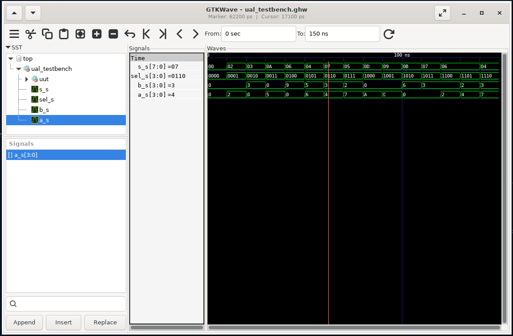

# Rapport VHDL : LogicGame

# Par :

- Corentin KERVAGORET
- Arnaud GRIVEL
- Mathias BENOIT

# Introduction

Ce projet a pour but de réaliser un mini jeu sur un microcontroleur: ARTY A7. Le but est ainsi de réaliser un Megamind sur ce controleur utilsant les huit LEDs de la carte.


# 1. Réalisation d'un ALU

L'ALU (Arithmetic and Logic Unit) est l'unité de calcul du microcontroleur. Il est capable de réaliser des opérations arithmétiques et logiques sur des entiers de 8 bits.
Elle est composée de plusieurs unités fonctionnelles, chacune étant responsable d'une opération spécifique. L'ALU est contrôlée par un signal de sélection qui détermine quelle opération doit être effectuée sur les entrées.

L'entité Hearth_UAL:

```vhdl
entity Hearth_UAL is
    port(
        A        : in  std_logic_vector(3 downto 0);
        B        : in  std_logic_vector(3 downto 0);
        SR_IN_L  : in  std_logic;                    -- bit de retenue d'entrée pour décalage à droite
        SR_IN_R  : in  std_logic;                    -- bit de retenue d'entrée pour décalage à gauche et addition

        SEL_FCT  : in  std_logic_vector(3 downto 0); -- SEL_FCT est le code de la fonction à réaliser

        SR_OUT_L : out std_logic;                    -- bit de retenue de sortie gauche
        SR_OUT_R : out std_logic;                    -- bit de retenue de sortie droite
        S        : out std_logic_vector(7 downto 0)   -- résultat ALU 8 bits
    );
end Hearth_UAL;
```

L'ALU est capable de réaliser les opérations suivantes :

- nop
- A
- B
- not A
- not B
- A and B
- A or B
- A xor B
- Décalage à droite de A
- Décalage à gauche de A
- Décalage à droite de B
- Décalage à gauche de B
- A+B avec retenue d'entrée
- A+B
- A-B
- A\*B

On a également créé des variables internes pour :

- Étendre A et B de 4 à 8 bits (grand_A, grand_B)

- Stocker les retenues d’entrée et de sortie (carry_in_left, carry_out_right, etc.)

- Construire le résultat 8 bits (resultat)

```vhdl
 -- Variables internes
        variable grand_A         : std_logic_vector(7 downto 0);
        variable grand_B         : std_logic_vector(7 downto 0);
        variable carry_in_left   : std_logic;
        variable carry_in_right  : std_logic;
        variable carry_out_left  : std_logic;
        variable carry_out_right : std_logic;
        variable resultat        : std_logic_vector(7 downto 0);
```

Pour valider le bon fonctionnement de l’ALU, nous avons développé un [testbench](./ual/ual_testbench.vhd) VHDL complet.
Pour ce faire nous avons utilisé des procédures en VHDL pour balayer toutes les combinaisons possibles de l'ALU : `display_case(name:string)` et `test_case(name:string)`

```vhdl
procedure display_case(name : string) is
begin
    report "Test: " & name & " | A=" & integer'image(to_integer(unsigned(A_sim))) &
            " B=" & integer'image(to_integer(unsigned(B_sim))) &
            " SR_IN_L=" & std_logic'image(SR_IN_L_sim) &
            " SR_IN_R=" & std_logic'image(SR_IN_R_sim) &
            " SEL_FCT=" & integer'image(to_integer(unsigned(SEL_sim))) &
            " S=" & integer'image(to_integer(unsigned(S_sim))) &
            " SR_OUT_L=" & std_logic'image(SR_OUT_L_sim) &
            " SR_OUT_R=" & std_logic'image(SR_OUT_R_sim);
end procedure;
```

```vhdl
procedure test_case(
    signal_name : string;
    sel_val     : std_logic_vector(3 downto 0);
    a_val, b_val : std_logic_vector(3 downto 0);
    sr_in_l, sr_in_r : std_logic;
    expected_S  : std_logic_vector(7 downto 0);
    expected_L, expected_R : std_logic := '0'
) is
begin
    SEL_sim <= sel_val;
    A_sim <= a_val;
    B_sim <= b_val;
    SR_IN_L_sim <= sr_in_l;
    SR_IN_R_sim <= sr_in_r;
    wait for 10 ns;
    display_case(signal_name);
    assert S_s = expected_S report signal_name & ": S incorrect" severity error;
    assert SR_OUT_L_s = expected_L report signal_name & ": SR_OUT_L incorrect" severity error;
    assert SR_OUT_R_s = expected_R report signal_name & ": SR_OUT_R incorrect" severity error;
end procedure;
```




# 2. Réalisation de l'interconnexion

L'interconnexion est responsable de la gestion des données entre les différentes unités de l'ALU. Elle permet de sélectionner les entrées et les sorties des différentes unités en fonction du signal de sélection.

L'entité interconnexion:

```vhdl
entity interconnexion is
    port(
        -- SEL_ROUTE permet de définir le transfert de données qui sera effectué lors du prochain cycle horloge (prochain front montant de l’horloge).
        SEL_ROUTE : in std_logic_vector(3 downto 0); -- Sélecteur de route

        A_IN      : in std_logic_vector(3 downto 0); -- Entrée A
        B_IN      : in std_logic_vector(3 downto 0); -- Entrée B
        S         : in std_logic_vector(7 downto 0); -- Entrée S

        -- La mémoire MEM_SEL_FCT permet de mémoriser la fonction arithmétique ou logique à réaliser.
        -- Elle est systématiquement chargée à chaque front montant d’horloge.
        MEM_CACHE_1_in: in std_logic_vector(7 downto 0); -- Mémoire cache 1
        MEM_CACHE_1_out_enable : out std_logic; -- Signal d'activation pour MEM_CACHE_1_ou
        MEM_CACHE_1_out : out std_logic_vector(7 downto 0); -- Sortie vers MEM_CACHE_1_out

        MEM_CACHE_2_in : in std_logic_vector(7 downto 0); -- Mémoire cache 2
        MEM_CACHE_2_out_enable : out std_logic; -- Signal d'activation pour MEM_CACHE_2_out_enable
        MEM_CACHE_2_out : out std_logic_vector(7 downto 0); -- Sortie vers MEM_CACHE_2_out

        -- Les mémoires Buffer_A, Buffer_B permettent de stocker les données directement liées au cœur de l’UAL, c'est-à-dire à la sous-fonction arithmétique et logique.
        -- Elles seront chargées (activées sur front montant de l’entrée clk) suivant les valeurs de l’entrée SEL_ROUTE
        Buffer_A  : out std_logic_vector(3 downto 0); -- Sortie vers Buffer A
        Buffer_A_enable : out std_logic; -- Signal d'activation pour Buffer A

        Buffer_B  : out std_logic_vector(3 downto 0); -- Sortie vers Buffer B
        Buffer_B_enable : out std_logic; -- Signal d'activation pour Buffer B

        SEL_OUT : in std_logic_vector(1 downto 0); -- Sélecteur de sortie
        RES_OUT : out std_logic_vector(7 downto 0) -- Sortie


    );
end interconnexion;
```

L'interconnexion permet ainsi de réaliser les opérations suivantes :

- A -> Buffer_A
- MEM_CACHE_1 -> Buffer_A (4 bits de poids faible)
- MEM_CACHE_1 -> Buffer_A (4 bits de poids fort)
- MEM_CACHE_2 -> Buffer_A (4 bits de poids faible)
- MEM_CACHE_2 -> Buffer_A (4 bits de poids fort)
- S -> Buffer_A (4 bits de poids faible)
- S -> Buffer_A (4 bits de poids fort)

- B -> Buffer_B
- MEM_CACHE_1 -> Buffer_B (4 bits de poids faible)
- MEM_CACHE_1 -> Buffer_B (4 bits de poids fort)
- MEM_CACHE_2 -> Buffer_B (4 bits de poids faible)
- MEM_CACHE_2 -> Buffer_B (4 bits de poids fort)
- S -> Buffer_B (4 bits de poids faible)
- S -> Buffer_B (4 bits de poids fort)

- S -> MEM_CACHE_1_in
- S -> MEM_CACHE_2_in
