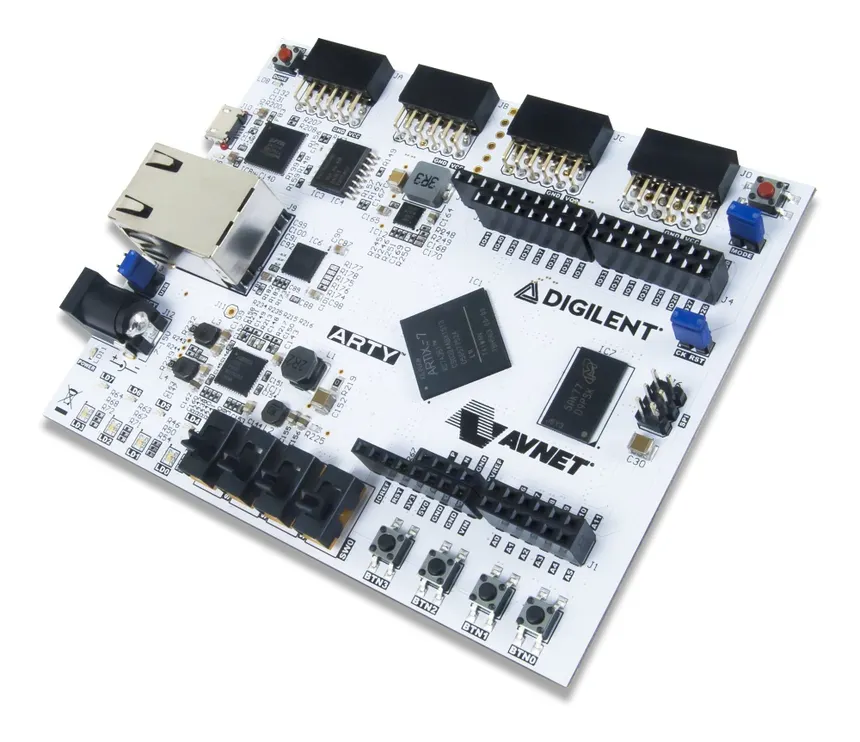
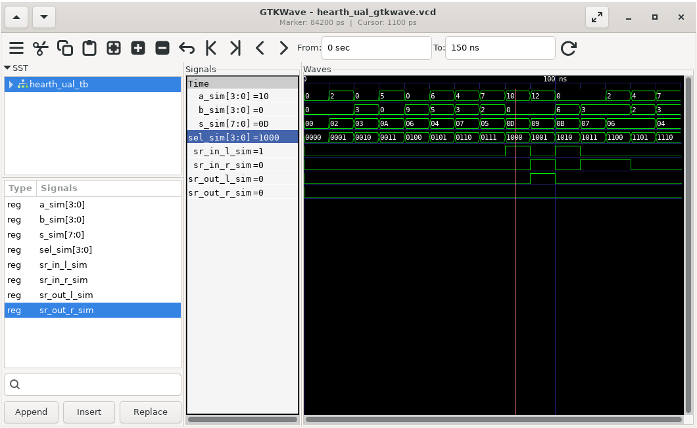
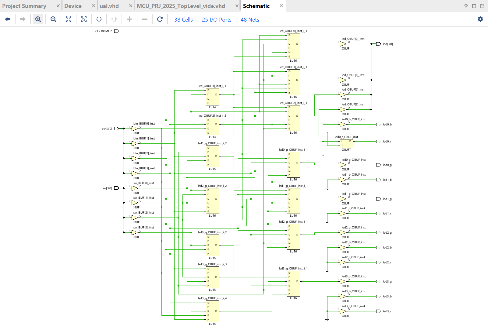
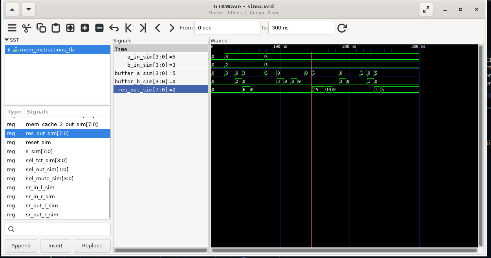

# 🎮 LogiGame – Rapport VHDL

**Auteurs :**

[Corentin KERVAGORET](https://github.com/Corentin-k) • [Arnaud GRIVEL](https://github.com/Arn7516) • [Mathias BENOIT](https://github.com/mat15tc)

---

## 🗂️ Sommaire

### 🧩 Cœur de contrôleur

1. [1️⃣ Réalisation d'un ALU](#1️⃣-réalisation-dun-alu)
2. [2️⃣ Buffers](#2️⃣-buffers)
3. [3️⃣ Réalisation de l’interconnexion](#3️⃣-réalisation-de-linterconnexion)
4. [4️⃣ Mémoire d'instructions](#4️⃣-mémoire-dinstructions)
5. [5️⃣ Top Level](#5️⃣-top-level)

### 🎮 Le jeu

5. [6️⃣ Minuteur](#6️⃣-minuteur)
6. [7️⃣ Compteur de score](#7️⃣-compteur-de-score)
7. [8️⃣ Vérificateur de réponse](#8️⃣-vérificateur-de-réponse)
8. [9️⃣ Générateur pseudo-aléatoire (LFSR)](#9️⃣-générateur-pseudo-aléatoire-lfsr)
9. [🔟 Contrôleur principal (FSM)](#🔟-contrôleur-principal-fsm)

### 📎 Annexes

10. [Vivado : Installation et Test de l’ALU](#vivado--installation-et-test-de-lalu)

---

<div class="page"/>

## 📝 Introduction

Ce projet consiste à réaliser un mini-jeu de type **Simon Game** sur la carte **ARTY A7** en utilisant les huit LEDs du microcontrôleur.
L’ensemble du projet a été développé sous **VS Code** avec **WSL** et simulé avec **GHDL** et **GTKWave**.



Les composants réalisés : ALU, Buffers, Interconnexion, Mémoire d'instructions et un top Level qui réunis tous les composants.

---

<div class="page"/>

## 🚀 Démarrage rapide

### Prérequis

- **Windows 10/11 avec WSL** (Windows Subsystem for Linux)
- **VS Code** avec l’extension Remote - WSL
- **GHDL** installé sous WSL (`sudo apt install ghdl gtkwave`)
- **GTKWave** pour visualiser les signaux (`sudo apt install gtkwave`)
- **Vivado** (pour la synthèse sur carte, voir : [Installation de Vivado](#vivado--installation-et-test-de-lalu))

### Installation et simulation sous WSL/VS Code

1. **Clone le dépôt** :

   ```bash
   git clone https://github.com/Corentin-k/VHDL-LogiGame.git
   cd VHDL-LogiGame
   ```

2. **Simuler un module avec le script fourni** :

   Plusieurs scripts bash sont fournis pour faciliter la simulation et la compilation des différents modules :

   - Dans le dossier racine du projet.
   - Pour tester un component qui ne dépend pas d'autres modules, utilisez :

     ```bash
     ./run_vhdl.sh nom_module
     ```

     Par exemple pour tester le testbench de l'interconnexion :

     ```bash
     ./run_vhdl.sh interconnexion
     ```

   - Pour ouvrir automatiquement GTKWave (visualisation des signaux) :

     ```bash
     ./run_vhdl.sh interconnexion --g
     ```

- Pour le test de la mémoire d'instruction et le top level deux scripts ont été réalisé :

  Les scripts compilent tous les modules nécessaires et lancent la simulation avec génération d’un fichier VCD pour GTKWave.

  ```bash
      ./test_mem.sh
      ./test_top.sh
  ```

---

<div class="page"/>

## 1️⃣ Réalisation d'un ALU

L'ALU (Arithmetic and Logic Unit) est l'unité de calcul du microcontroleur. Il est capable de réaliser des opérations arithmétiques et logiques sur des entiers de 8 bits.
Il est composé de plusieurs unités fonctionnelles, chacune étant responsable d'une opération spécifique. L'ALU est contrôlée par un signal de sélection `SEL_FCT` qui détermine quelle opération doit être effectuée sur les entrées `A` et `B` .

### ✨ Entité `Hearth_UAL`

L’ALU prend en entrée :

- Deux valeurs A et B sur 4 bits (std_logic_vector(3 downto 0))
- Deux bits de retenue (SR_IN_L et SR_IN_R) pour les opérations de décalage et d’addition
- Un code de fonction (SEL_FCT) sur 4 bits qui sélectionne l’opération à effectuer

Elle fournit en sortie :

- Le résultat S sur 8 bits (std_logic_vector(7 downto 0))
- Deux bits de retenue de sortie (SR_OUT_L et SR_OUT_R)

```vhdl

entity hearth_ual is
    port(
        A        : in  std_logic_vector(3 downto 0);
        B        : in  std_logic_vector(3 downto 0);
        SR_IN_L  : in  std_logic;                    -- bit de retenue d'entrée pour décalage à droite
        SR_IN_R  : in  std_logic;                    -- bit de retenue d'entrée pour décalage à gauche et addition

        SEL_FCT  : in  std_logic_vector(3 downto 0); -- SEL_FCT est le code de la fonction à réaliser

        SR_OUT_L : out std_logic;                    -- bit de retenue de sortie gauche
        SR_OUT_R : out std_logic;                    -- bit de retenue de sortie droite
        S        : out std_logic_vector(7 downto 0)   -- résultat ALU 8 bits
    );
end hearth_ual;
```

### 🔢 Opérations prises en charge

L'ALU est capable de réaliser les opérations suivantes :

| Code | Opération           |
| ---- | ------------------- |
| 0000 | nop                 |
| 0001 | A                   |
| 0010 | B                   |
| 0011 | not A               |
| 0100 | not B               |
| 0101 | A and B             |
| 0110 | A or B              |
| 0111 | A xor B             |
| 1000 | Décalage à droite A |
| 1001 | Décalage à gauche A |
| 1010 | Décalage à droite B |
| 1011 | Décalage à gauche B |
| 1100 | A+B avec retenue    |
| 1101 | A+B                 |
| 1110 | A-B                 |
| 1111 | A\*B                |

### 🛠️ Variables internes

Pour certaines opérations (addition, soustraction, multiplication), il est nécessaire de travailler sur des vecteurs plus larges que les entrées d’origine pour éviter les erreurs de débordement et permettre une gestion correcte du signe (signed/unsigned).

On a donc créé des variables internes grand_A et grand_B :

Ces variables étendent A et B de 4 à 8 bits.
Les 4 bits de poids fort sont remplis avec le bit de signe (A(3) ou B(3)), ce qui permet de conserver le signe lors des opérations arithmétiques (extension de signe pour signed).
Les 4 bits de poids faible reprennent la valeur d’origine.

```vhdl

        variable grand_A         : std_logic_vector(7 downto 0);
        variable grand_B         : std_logic_vector(7 downto 0);

        grand_A(7 downto 4) := (others => A(3));
        grand_A(3 downto 0) := A;
        grand_B(7 downto 4) := (others => B(3));
        grand_B(3 downto 0) := B;
```

## 🧪 Test de l'ALU

Pour valider le bon fonctionnement de l’ALU, nous avons développé un [testbench](./hearth_ual/hearth_ual_testbench.vhd) VHDL complet.
Pour ce faire nous avons utilisé des procédures en VHDL pour balayer toutes les combinaisons possibles de l'ALU : `display_case(name:string)` et `test_case(name:string)`

```vhdl
procedure display_case(name : string) is
begin
    report "Test: " & name & " | A=" & integer'image(to_integer(unsigned(A_sim))) &
            " B=" & integer'image(to_integer(unsigned(B_sim))) &
            " SR_IN_L=" & std_logic'image(SR_IN_L_sim) &
            " SR_IN_R=" & std_logic'image(SR_IN_R_sim) &
            " SEL_FCT=" & integer'image(to_integer(unsigned(SEL_sim))) &
            " S=" & integer'image(to_integer(unsigned(S_sim))) &
            " SR_OUT_L=" & std_logic'image(SR_OUT_L_sim) &
            " SR_OUT_R=" & std_logic'image(SR_OUT_R_sim);
end procedure;
```

```vhdl
procedure test_case(
    signal_name : string;
    sel_val     : std_logic_vector(3 downto 0);
    a_val, b_val : std_logic_vector(3 downto 0);
    sr_in_l, sr_in_r : std_logic;
    expected_S  : std_logic_vector(7 downto 0);
    expected_L, expected_R : std_logic := '0'
) is
begin
    SEL_sim <= sel_val;
    A_sim <= a_val;
    B_sim <= b_val;
    SR_IN_L_sim <= sr_in_l;
    SR_IN_R_sim <= sr_in_r;
    wait for 10 ns;
    display_case(signal_name);
    assert S_s = expected_S report signal_name & ": S incorrect" severity error;
    assert SR_OUT_L_s = expected_L report signal_name & ": SR_OUT_L incorrect" severity error;
    assert SR_OUT_R_s = expected_R report signal_name & ": SR_OUT_R incorrect" severity error;
end procedure;
```



Ici nous avons un exemple de test de l'ALU :
sel_s = "1000" se qui correspond à l'opération shift droit de A avec une entrée de retenue qui vaut 1. On peut voir que le résultat est bien le bon. A vaut 10 soit 1010 et le résultat est donc 0D soit 1101.

Ou directement par les asserts :

```bash
ghdl -r --std=08 --ieee=synopsys ual_testbench --wave=ual_testbench.ghw

Test: NOP | A=0 B=0 SR_IN_L='0' SR_IN_R='0' SEL_FCT=0 S=0 SR_OUT_L='0' SR_OUT_R='0'
Test: S=A | A=2 B=0 SR_IN_L='0' SR_IN_R='0' SEL_FCT=1 S=2 SR_OUT_L='0' SR_OUT_R='0'
Test: S=B | A=0 B=3 SR_IN_L='0' SR_IN_R='0' SEL_FCT=2 S=3 SR_OUT_L='0' SR_OUT_R='0'
R='0'
Test: S=A and B | A=6 B=5 SR_IN_L='0' SR_IN_R='0' SEL_FCT=5 S=4 SR_OUT_L='0' SR_OUT_R='0'
Test: S=A or B | A=4 B=3 SR_IN_L='0' SR_IN_R='0' SEL_FCT=6 S=7 SR_OUT_L='0' SR_OUT_R='0'
Test: S=A xor B | A=7 B=2 SR_IN_L='0' SR_IN_R='0' SEL_FCT=7 S=5 SR_OUT_L='0' SR_OUT_R='0'
Test: Shift droit A | A=10 B=0 SR_IN_L='1' SR_IN_R='0' SEL_FCT=8 S=13 SR_OUT_L='0' SR_OUT_R='0'
Test: Shift gauche A | A=12 B=0 SR_IN_L='0' SR_IN_R='1' SEL_FCT=9 S=9 SR_OUT_L='1' SR_OUT_R='0'
Test: Shift droit B | A=0 B=6 SR_IN_L='1' SR_IN_R='0' SEL_FCT=10 S=11 SR_OUT_L='0' SR_OUT_R='0'
Test: Shift gauche B | A=0 B=3 SR_IN_L='0' SR_IN_R='1' SEL_FCT=11 S=7 SR_OUT_L='0' SR_OUT_R='0'
Test: Addition A+B+SR_IN_R | A=2 B=3 SR_IN_L='0' SR_IN_R='1' SEL_FCT=12 S=6 SR_OUT_L='0' SR_OUT_R='0'
Test: Addition A+B | A=4 B=2 SR_IN_L='0' SR_IN_R='0' SEL_FCT=13 S=6 SR_OUT_L='0' SR_OUT_R='0'
Test: Soustraction A-B | A=7 B=3 SR_IN_L='0' SR_IN_R='0' SEL_FCT=14 S=4 SR_OUT_L='0' SR_OUT_R='0'

Tous les tests passés avec succès.
```

> [!NOTE]  
> Note : pour la lecutre nous avons supprimé chqaue 'hearth_ual_testbench.vhd:50:13:@60ns:(report note):' devant les tests pour une meilleure lisibilité.

## 🗺️ Schéma de l’ALU



---

<div class="page"/>

## 2️⃣ Buffers

### ✨ Entité `buffer_ual`

Au début du projet, deux types de buffers étaient envisagés :

- **Buffer avec signal d’activation (`enable`)** : la sortie **est modifiée uniquement si `enable` est à '1'** ; sinon, la valeur précédente est conservée (la modification est empêchée).
- **Buffer sans signal d’activation** : la sortie **est modifiée à chaque front d’horloge**, sans condition.

Après expérimentation, il s’est avéré plus simple et flexible d’utiliser uniquement le buffer avec signal `enable`.  
Pour obtenir le comportement d’un buffer "sans enable", il suffit de connecter `enable` à `'1'` lors de l’instanciation.

Le composant `buffer_ual` est **générique** grâce au paramètre `N`, ce qui permet de créer des buffers de n’importe quelle taille (4 bits, 8 bits, etc.) selon les besoins du module (`Buffer_A`, `Buffer_B`, `MEM_CACHE_1`, `MEM_CACHE_2`…).

**Fonctionnement** :  
À chaque front montant de l’horloge, si `enable = '1'`, la valeur d’entrée `e1` est mémorisée et disponible sur la sortie `s1`.  
Si `enable = '0'`, la sortie conserve sa valeur précédente (la modification est empêchée).  
Le reset asynchrone permet de remettre la sortie à zéro à tout moment.

```vhdl
entity buffer_ual is
    generic (
        N : integer := 4
    );
    port (
        e1     : in  std_logic_vector (N-1 downto 0);
        reset  : in  std_logic;
        clock  : in  std_logic;
        enable : in  std_logic;
        s1     : out std_logic_vector (N-1 downto 0)
    );
end buffer_ual;
```

## 🧪 Test des buffers avec/sans enable:

```bash
./run_vhdl.sh buffer_ual --g
buffer_ual_testbench.vhd:67:9:@0ms:(report note): Buffer 4 bits sans enable :
buffer_ual_testbench.vhd:72:9:@10ns:(report note): e1_sim:10
buffer_ual_testbench.vhd:73:9:@10ns:(report note): s1_sim1: 10
buffer_ual_testbench.vhd:77:9:@20ns:(report note): e1_sim:5
buffer_ual_testbench.vhd:78:9:@20ns:(report note): s1_sim1: 5
buffer_ual_testbench.vhd:80:9:@20ns:(report note): -------------------------------
buffer_ual_testbench.vhd:82:9:@20ns:(report note): Buffer 3 bits avec enable :
buffer_ual_testbench.vhd:84:10:@20ns:(report note): e2_sim:0
../../src/ieee/v93/numeric_std-body.vhdl:2098:7:@20ns:(assertion warning): NUMERIC_STD.TO_INTEGER: metavalue detected, returning 0
buffer_ual_testbench.vhd:85:9:@20ns:(report note): s2_sim1: 0
buffer_ual_testbench.vhd:90:9:@40ns:(report note): e2_sim:1
../../src/ieee/v93/numeric_std-body.vhdl:2098:7:@40ns:(assertion warning): NUMERIC_STD.TO_INTEGER: metavalue detected, returning 0
buffer_ual_testbench.vhd:91:9:@40ns:(report note): Valeur de s1_sim2: 0
buffer_ual_testbench.vhd:93:9:@40ns:(report note): >>> Activation de enable !
buffer_ual_testbench.vhd:99:9:@50ns:(report note): e2_sim:7
buffer_ual_testbench.vhd:100:9:@50ns:(report note): Valeur de s1_sim2 après activation enable: 7
buffer_ual_testbench.vhd:104:9:@60ns:(report note): >>> Remodification de la valeur sans activer enable !
buffer_ual_testbench.vhd:108:9:@80ns:(report note): e2_sim:1
buffer_ual_testbench.vhd:109:9:@80ns:(report note): Valeur de s1_sim2: 7
```

On remarque que malgres la tentatvide modifier la valeur de e2_sim sans activer enable, il conserve la valeur précédentes.

---

## 3️⃣ Réalisation de l’interconnexion

L'interconnexion est responsable de la gestion des données entre les différentes unités de l'ALU. Elle permet de sélectionner les entrées et les sorties des différentes unités en fonction du signal de sélection.

### ✨ Entité `interconnexion`

```vhdl
entity interconnexion is
    port(
        -- SEL_ROUTE permet de définir le transfert de données qui sera effectué lors du prochain cycle horloge (prochain front montant de l’horloge).
        SEL_ROUTE : in std_logic_vector(3 downto 0); -- Sélecteur de route

        A_IN      : in std_logic_vector(3 downto 0); -- Entrée A
        B_IN      : in std_logic_vector(3 downto 0); -- Entrée B
        S         : in std_logic_vector(7 downto 0); -- Entrée S


        MEM_CACHE_1_in: in std_logic_vector(7 downto 0); -- Mémoire cache 1
        MEM_CACHE_1_out_enable : out std_logic; -- Signal d'activation pour MEM_CACHE_1_ou
        MEM_CACHE_1_out : out std_logic_vector(7 downto 0); -- Sortie vers MEM_CACHE_1_out

        MEM_CACHE_2_in : in std_logic_vector(7 downto 0); -- Mémoire cache 2
        MEM_CACHE_2_out_enable : out std_logic; -- Signal d'activation pour MEM_CACHE_2_out_enable
        MEM_CACHE_2_out : out std_logic_vector(7 downto 0); -- Sortie vers MEM_CACHE_2_out

        -- Les mémoires Buffer_A, Buffer_B permettent de stocker les données directement liées au cœur de l’UAL, c'est-à-dire à la sous-fonction arithmétique et logique.
        -- Elles seront chargées (activées sur front montant de l’entrée clk) suivant les valeurs de l’entrée SEL_ROUTE
        Buffer_A  : out std_logic_vector(3 downto 0); -- Sortie vers Buffer A
        Buffer_A_enable : out std_logic; -- Signal d'activation pour Buffer A

        Buffer_B  : out std_logic_vector(3 downto 0); -- Sortie vers Buffer B
        Buffer_B_enable : out std_logic; -- Signal d'activation pour Buffer B

        SEL_OUT : in std_logic_vector(1 downto 0); -- Sélecteur de sortie
        RES_OUT : out std_logic_vector(7 downto 0) -- Sortie


    );
end interconnexion;
```

### 🧪 Test de l'interconnexion

> Fichier de test : [interconnexion_testbench.vhd](./interconnexion_testbench.vhd)

```bash
./run_vhdl.sh interconnexion
interconnexion_testbench.vhd:84:9:@0ms:(report note): ---------------------------
interconnexion_testbench.vhd:85:9:@0ms:(report note): Test routage A_IN vers Buffer_A
interconnexion_testbench.vhd:89:9:@10ns:(report note): SEL_ROUTE = 0 A_IN = 10 Buffer_A: 10
interconnexion_testbench.vhd:94:9:@10ns:(report note): ---------------------------
interconnexion_testbench.vhd:95:9:@10ns:(report note): Test S vers MEM_CACHE_1_out
interconnexion_testbench.vhd:99:9:@20ns:(report note): SEL_ROUTE = 14 S = 1 MEM_CACHE_1_out: 1
interconnexion_testbench.vhd:104:9:@20ns:(report note): ---------------------------
interconnexion_testbench.vhd:105:9:@20ns:(report note): Test S vers RES_OUT
interconnexion_testbench.vhd:111:9:@30ns:(report note): SEL_ROUTE = 0 S = 3 RES_OUT: 3 ready (le calcul est effectué)= '1'
```

### 🔄 Opérations possibles

L'interconnexion permet ainsi de réaliser les opérations suivantes :

- **A -> Buffer_A**
- **MEM_CACHE_1 -> Buffer_A** (4 bits de poids faible)
- **MEM_CACHE_1 -> Buffer_A** (4 bits de poids fort)
- **MEM_CACHE_2 -> Buffer_A** (4 bits de poids faible)
- **MEM*CACHE_2 -> Buffer***A (4 bits de poids fort)
- **S -> Buffer_A** (4 bits de poids faible)
- **S -> Buffer_A** (4 bits de poids fort)

- **B -> Buffer_B**
- **MEM_CACHE_1 -> Buffer_B** (4 bits de poids faible)
- **MEM_CACHE_1 -> Buffer_B** (4 bits de poids fort)
- **MEM_CACHE_2 -> Buffer_B** (4 bits de poids faible)
- **MEM_CACHE_2 -> Buffer_B** (4 bits de poids fort)
- **S -> Buffer_B** (4 bits de poids faible)
- **S -> Buffer_B** (4 bits de poids fort)

- **S -> MEM_CACHE_1_in**
- **S -> MEM_CACHE_2_in**

---

## 4️⃣ Mémoire d'instructions

### ✨ Entité `mem_instructions`

La mémoire d’instructions contient le programme à exécuter (suite d’instructions codées sur 10 bits).

```vhdl
entity mem_instructions is
    port (
        clk         : in  std_logic;
        reset       : in  std_logic;
        instruction : in  unsigned(6 downto 0); -- Adresse (7 bits)
        donnee      : out std_logic_vector(9 downto 0) -- Instruction lue
    );
end mem_instructions;
```

**Fonctionnement** : À chaque front montant de `clk`, l’instruction à l’adresse `instruction` est placée sur `donnee`.

### 🧪 Test de la mémoire d'instructions

> Fichier de test : [mem_instructions_testbench.vhd](./mem_instructions_testbench.vhd)

```bash
coco@MSI:/mnt/c/Users/ckerv/OneDrive - Efrei/EFREI/L3/Semestre 6/VHDL2/mem_instructions$ ./mem.sh
mem_instructions_testbench.vhd:225:9:@47ns:(report note): RES_OUT = 6
mem_instructions_testbench.vhd:245:5:@147ns:(report note): RES_OUT (A+B xnor A) = 2
mem_instructions_testbench.vhd:260:5:@237ns:(report note): RES_OUT (A0 and B1) or (A1 and B0) = 1
```



---

## 5️⃣ Top Level

Réunis tous les composants précédents, le top level est l'entité principale qui orchestre le fonctionnement du microcontrôleur.

### 🧪 Test du Top Level

> Fichier de test : [MCU_PRJ_2025_TopLevel_testbench.vhd](./MCU_PRJ_2025_TopLevel_testbench.vhd)

```bash
./test_top.sh
top_level_testbench.vhd:69:9:@0ms:(report note):  Test du top_level
top_level_testbench.vhd:74:9:@20ns:(report note): ----------------------------
top_level_testbench.vhd:75:9:@20ns:(report note): Appuie sur le bouton 0 pour réinitialiser
top_level_testbench.vhd:80:9:@1120ns:(report note): BTN 0 reset : '0''0''0''0''0''0''0''0' | sw=1111
top_level_testbench.vhd:91:9:@1120ns:(report note): ----------------------------
top_level_testbench.vhd:92:9:@1120ns:(report note): Appuie sur le bouton 1 pour tester la premiere fonction :
top_level_testbench.vhd:101:9:@2020ns:(report note): A*B : '0''0''0''0''0''0''0''1' | sw=1111
top_level_testbench.vhd:112:9:@2020ns:(report note): ----------------------------
top_level_testbench.vhd:113:9:@2020ns:(report note): Appuie sur le bouton 1 pour tester la deuxieme fonction :
top_level_testbench.vhd:121:9:@2920ns:(report note): (A + B) xnor  A ='0''0''0''0''1''1''1''0' | sw=1111
top_level_testbench.vhd:132:9:@2920ns:(report note): ----------------------------
top_level_testbench.vhd:133:9:@2920ns:(report note): Appuie sur le bouton 3 pour tester la troisieme fonction :
top_level_testbench.vhd:141:9:@3820ns:(report note): (A0 and  B1) or (A1 and B0) ='0''0''0''0''0''1''1''1' | sw=1111
top_level_testbench.vhd:152:9:@3820ns:(assertion failure): Fin de simulation à 5000 ns
```

## 6️⃣ Minuteur

Le module **minuteur** permet de gérer le temps imparti pour répondre à chaque question.

### ✨ Entité `Minuteur`

```vhdl
entity Minuteur is
    port (
        clk      : in std_logic;
        reset    : in std_logic;
        start    : in std_logic;
        sw_level : in std_logic_vector(1 downto 0);
        time_out : out std_logic
    );
end Minuteur;
```

- Le temps de réponse dépend de `sw_level` (niveau de difficulté).
- Le signal `time_out` passe à '1' lorsque le temps est écoulé.

---

## 7️⃣ Compteur de score

Le module **score_compteur** gère le score du joueur.

### ✨ Entité `score_compteur`

```vhdl
entity score_compteur is
    port (
        clk       : in  std_logic; -- horloge système
        reset     : in  std_logic; --remise à zéro du score
        valid_hit : in  std_logic; -- indiquant la réussite (1) ou l’échec (0)
        score     : out std_logic_vector(3 downto 0); -- score courant codé sur 4 bits
        game_over : out std_logic -- signal indiquant la fin du jeu
    );
end score_compteur;
```

- Le score s’incrémente à chaque bonne réponse (`valid_hit = '1'`).
- `game_over` passe à '1' lorsque le score atteint 15.

---

## 8️⃣ Vérificateur de réponse

Le module **verif_resultat** valide si le joueur a appuyé sur le bon bouton dans le temps imparti.

### ✨ Entité `verif_resultat`

```vhdl
entity verif_resultat is
    port (
        clk       : in  std_logic; -- horloge système
        reset     : in  std_logic; -- réinitialisation du module
        timeout   : in  std_logic; -- signal de fin de délai
        led_color : in  std_logic_vector(2 downto 0); -- couleur affichée sur LD3 (3 bits, R=100, G=010, B=001)
        btn_r     : in  std_logic; -- boutons de réponse (BTN1, BTN2, BTN3)
        btn_g     : in  std_logic;
        btn_b     : in  std_logic;
        valid_hit : out std_logic -- passe à '1' si la bonne réponse a été donnée dans les temps
    );
end verif_resultat;
```

- `valid_hit` passe à '1' uniquement si le bon bouton est pressé avant le timeout.
- Un seul appui est comptabilisé par round.

---

## 9️⃣ Générateur pseudo-aléatoire (LFSR)

Le module **LFSR** (Linear Feedback Shift Register) génère une séquence pseudo-aléatoire de 4 bits, utilisée pour le choix aléatoire des couleurs.

### ✨ Entité `lfsr`

```vhdl
entity lfsr is
    port(
        CLK100MHZ : in std_logic;  -- horloge principale (100 MHz)
        reset : in std_logic;  -- réinitialisation du registre à une valeur initiale non nulle «1011»
        enable : in std_logic;  -- active l’évolution du LFSR à chaque front montant
        rnd : out std_logic_vector(3 downto 0)  -- vecteur de 4 bits représentant la valeur pseudo-aléatoire courante
    );
end lfsr;
```

- À chaque front montant de l’horloge, si `enable='1'`, la sortie `rnd` change selon le polynôme X⁴ + X³ + 1.
- La valeur initiale est fixée à `"1011"` pour éviter la séquence nulle.

## 🔟 Contrôleur principal (FSM)

Le module **FSM** (Finite State Machine) orchestre l’ensemble du jeu LogiGame : il gère le lancement du timer, la vérification de la réponse, l’incrémentation du score et la détection de la fin de partie.

### ✨ Entité `fsm`

```vhdl
entity fsm is
    port (
        clk        : in  std_logic; -- horloge système (100 MHz)
        reset      : in  std_logic; -- remise à zéro globale
        start      : in  std_logic; -- bouton de démarrage
        sw_level   : in  std_logic_vector(1 downto 0); -- niveau de difficulté
        btn_r      : in  std_logic; -- bouton rouge
        btn_g      : in  std_logic; -- bouton vert
        btn_b      : in  std_logic; -- bouton bleu
        led_color  : out std_logic_vector(2 downto 0); -- couleur affichée sur LD3
        score      : out std_logic_vector(3 downto 0); -- score courant
        game_over  : out std_logic -- signal de fin de partie
    );
end fsm;
```

- L’état du jeu évolue selon un **automate à états finis** :
  - **IDLE** : attente du bouton start
  - **NEW_ROUND** : génération d’un nouveau stimulus et lancement du timer
  - **WAIT_RESPONSE** : attente de la réponse ou du timeout
  - **END_GAME** : blocage du jeu en cas de défaite ou score maximal
- Le FSM pilote les modules internes : LFSR, minuteur, score_compteur, verif_resultat.

---

## Vivado : Installation et Test de l’ALU

### 📦 Installation de Vivado

- Installer **Vivado ML Standard** (minimum requis pour ARTY A7).


---

### 🏗️ Création du projet

Puis créer un nouveau projet et faire les configurations suivantes :

1. **Créer un projet** :

   - Type : RTL Project
   - Composant : `XC7A35TCSG324-1`
   - Target language : **VHDL**

2. **Ajouter les sources** :
   - Contraintes : `PRJ_24-25_Entite_TopLevel_Constraints.xdc`
   - Design sources :
     - `MCU_PRJ_2025_TopLevel_vide.vhd`
     - **Votre ALU**

Ajoutez votre entité ALU en tant que composant dans `MCU_PRJ_2025_TopLevel_vide` :

```vhdl

 -- Ajout de votre entité alu en tant que component
    signal My_A,My_B, My_SEL_FCT : std_logic_vector(3 downto 0);
    signal My_SR_IN_R , My_SR_IN_L, My_SR_OUT_L, My_SR_OUT_R: std_logic;
    signal My_S  : std_logic_vector(7 downto 0);
begin
    MyUALCore : Nom_de_votre_entité
    Port Map(
        A=>sw,
        B =>sw,
        SR_IN_L => sw(3),
        SR_IN_R=>sw(0),
        S=> My_S,
        SR_OUT_L=>led3_b,
        SR_OUT_R=>led2_b,
        SEL_FCT=>btn
        );

    led <= My_S(7 downto 4);
    led0_g <= My_S(0);  led0_b <='0';
    led1_g <= My_S(1);  led1_b <='0'; led1_r <='0';
    led2_g <= My_S(2);  led2_b <='0';led2_r <='0';
    led3_g <= My_S(3);  led3_b <='0';led3_r <='0';


end MCU_PRJ_2021_TopLevel_Arch;
```
